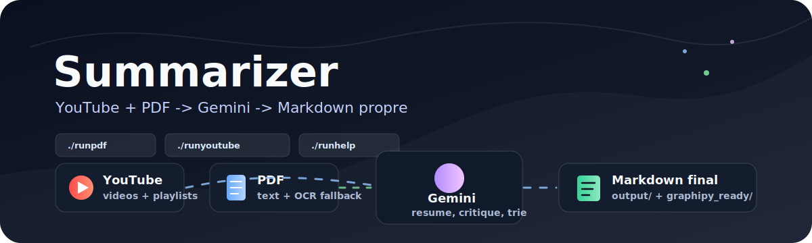

<p align="center">
  
</p>

<p align="center">
  
  
  
</p>

<h1 align="center">Summarizer</h1>

<p align="center">
  <strong>Des sources difficiles à lire. Une connaissance claire, vérifiable et prête à utiliser.</strong>
</p>

## D'une source difficile à lire à une connaissance vraiment utilisable

Summarizer transforme des livres, des PDF techniques, des vidéos et des playlists YouTube en
documents clairs, structurés et faciles à réutiliser.

Ce n'est pas seulement un outil qui raccourcit un texte. Il aide à comprendre une expertise,
à retrouver les idées importantes et à s'en servir pour apprendre, documenter un sujet ou construire
un nouvel outil.

### En une phrase

> Tu donnes un livre ou un lien. Tu récupères une synthèse lisible, précise et orientée vers ce que
> tu veux réellement comprendre.

## Ce que tu peux faire

### Lire un livre ou un PDF

Dépose un PDF dans le dossier indiqué par le menu. Summarizer peut travailler sur un document texte,
un scan, un livre rempli de tableaux, de formules ou de graphiques.

Tu peux demander deux types de résultat :

- sans question : une lecture neutre, chapitre par chapitre, avec les concepts, les exemples et les
  limites expliqués clairement ;
- avec une question : une synthèse ciblée sur ton projet, ton métier ou le problème que tu veux résoudre.

### Comprendre une vidéo ou une playlist

Colle simplement le lien YouTube. Le logiciel comprend automatiquement s'il s'agit d'une vidéo seule
ou d'une playlist. Chaque vidéo est traitée séparément et peut être reprise si le traitement est
interrompu.

### Transformer une expertise en outil

Une connaissance métier bien extraite peut devenir la base d'un outil spécialisé : un calculateur,
un moteur de scénarios, un système de recherche, une checklist ou des garde-fous métier.

Summarizer sert de pont entre la source originale et l'outil que tu veux construire.

## Voir le résultat en quelques minutes

```bash
git clone https://github.com/Insular2895/summarizer.git
cd summarizer
cp .env.example .env
./summarizer
```

Dans `.env`, remplis uniquement la clé du fournisseur que tu veux utiliser. Laisse les autres vides :
elles ne seront pas activées.

```env
GEMINI_API_KEY=ta_cle_api_gemini
```

## Quelle IA utiliser ?

Le projet est aujourd'hui configuré et testé avec **Gemini**. Il suffit de renseigner
`GEMINI_API_KEY` et de laisser les autres clés vides.

Gemini est recommandé pour commencer parce que Google propose généralement une offre gratuite avec
des quotas adaptés à un usage personnel ou à des tests. Ce n'est pas une gratuité illimitée : les
quotas, les modèles disponibles et les conditions peuvent varier selon le compte et l'utilisation.

Le projet propose maintenant trois modes :

- `gemini` : le mode recommandé par défaut ;
- `openai_compatible` : OpenAI, Mistral, OpenRouter, Ollama, LM Studio, vLLM et les endpoints qui
  suivent le format OpenAI Chat Completions ;
- `anthropic` : l'API Claude Messages.

Pour utiliser un fournisseur compatible OpenAI :

```env
LLM_PROVIDER=openai_compatible
LLM_API_KEY=ta_cle_api
LLM_BASE_URL=https://api.openai.com/v1
LLM_MODEL_VIDEO_SIMPLE=gpt-4o-mini
LLM_MODEL_PDF_DEEP=gpt-4o
```

Pour Anthropic :

```env
LLM_PROVIDER=anthropic
LLM_API_KEY=ta_cle_anthropic
LLM_MODEL_PDF_DEEP=claude-sonnet-4-20250514
```

Les noms `LLM_MODEL_...` permettent de choisir le modèle pour chaque étape sans modifier le code.
Les modèles configurés dans `config/models.yaml` restent les valeurs par défaut de Gemini.

Avec `LLM_PROVIDER=auto`, le logiciel choisit automatiquement la première clé non vide. Pour éviter
toute ambiguïté si plusieurs clés sont présentes, force le fournisseur voulu avec `LLM_PROVIDER`.

En résumé : **Gemini fonctionne immédiatement ; les autres fournisseurs peuvent maintenant être
branchés par configuration, à condition que le modèle choisi supporte le texte ou la vision demandée.**

Ensuite, le menu te guide. Il reste ouvert après chaque traitement : tu peux enchaîner plusieurs
documents ou liens sans retenir les commandes.

> Un téléchargement GitHub ne peut pas lancer automatiquement un programme sur l'ordinateur de
> quelqu'un. La seule commande à retenir est donc `./summarizer`.

## Le parcours PDF est simple

1. Lance `./summarizer`.
2. Choisis `1. Résumer un PDF`.
3. Si aucun fichier n'est trouvé, le dossier `input/pdf/` s'ouvre automatiquement.
4. Dépose ton PDF dans ce dossier et appuie sur Entrée.
5. Laisse la lecture neutre par défaut ou écris une consigne précise.

Exemple de consigne :

```bash
./runpdf "input/pdf/mon-livre.pdf" \
  --instruction "Explique les méthodes utiles pour construire un outil de gestion du risque."
```

Le fichier principal à lire est ensuite créé dans `output/books/`. Les fichiers de contrôle et de
preuve restent disponibles à côté pour ceux qui veulent vérifier le travail, mais ils ne polluent
pas la lecture du résumé.

## Le parcours YouTube est unifié

Depuis le menu, choisis l'option YouTube et colle l'un ou l'autre lien :

```bash
./runyoutube "https://youtube.com/watch?v=..."
./runyoutube "https://youtube.com/playlist?list=..."
```

Les transcriptions sont conservées localement et réutilisées quand c'est possible. Cela évite de
télécharger deux fois la même vidéo et permet de reprendre une playlist interrompue.

## Étude de cas : *Trading Option Greeks*

Pour tester la méthode sur une vraie source métier, nous avons traité *Trading Option Greeks* de
Dan Passarelli, un ouvrage de **357 pages** sur les options, la volatilité et la gestion des risques.

Le livre contenait du texte, des pages scannées, des formules, des graphiques et des payoff diagrams.
Le pipeline a dû combiner plusieurs méthodes pour ne pas se contenter d'une extraction superficielle :

- **354 pages OCR** lorsque le texte original n'était pas exploitable ;
- **197 éléments complexes détectés** : figures, formules, graphiques et tableaux ;
- **14 contrôles visuels Gemini** sur des preuves ciblées ;
- une transcription vérifiable, un rapport de qualité et une synthèse lisible.

Le résultat explique les Greeks, la volatilité implicite et réalisée, le delta-neutral, le gamma
scalping, les spreads, les straddles, les strangles et les principaux risques d'exécution.

La valeur ne vient donc pas seulement du nombre de pages résumées. Elle vient du fait que la source
devient exploitable pour réfléchir à de futurs outils :

```text
Connaissance métier
        -> concepts et mécanismes
        -> exemples et scénarios
        -> hypothèses et limites
        -> idée d'outil
        -> tests et validation humaine
```

On peut ensuite imaginer un calculateur de Greeks, un moteur de scénarios de risque, un analyseur de
volatilité ou un système de garde-fous. Le livre ne devient jamais automatiquement une décision
financière : les points ambigus restent signalés et doivent être validés.

## Une installation légère, des capacités avancées à la demande

L'installation de base reste légère. Les moteurs lourds ne sont pas imposés à tous les utilisateurs.
Si un PDF scanné ou complexe en a besoin, le terminal explique ce qui va être installé et propose
le pack recommandé **OCRmyPDF + MinerU + Marker**, ou l'annulation.

Une image Docker reproductible est également disponible :

```bash
cp .env.example .env
docker compose build
docker compose run --rm summarizer run-pdf input/pdf/mon-livre.pdf
docker compose run --rm summarizer run-youtube "https://youtube.com/..."
```

## Ce que tu obtiens

```text
output/books/   synthèses de livres et PDF
output/videos/  synthèses de vidéos et playlists
```

Les documents finaux sont en Markdown : ils peuvent être lus directement, recherchés, versionnés
ou importés dans une base de connaissance comme Graphipy.

Les fichiers temporaires, les preuves et les détails techniques sont séparés des résultats destinés
à la lecture.

## Respect de la vie privée

Le projet est conçu pour fonctionner localement. Tes PDF, transcriptions, caches et résultats restent
sur ta machine et ne sont pas destinés à être publiés dans GitHub.

Ne commit jamais `.env`, une clé API, des cookies, des PDF ou des sorties personnelles.

## Commandes utiles

| Besoin | Commande |
|---|---|
| Ouvrir le menu | `./summarizer` |
| Voir l'aide | `./runhelp` |
| Résumer un PDF | `./runpdf "input/pdf/mon-livre.pdf"` |
| Résumer une vidéo ou playlist | `./runyoutube "https://youtube.com/..."` |
| Vérifier les moteurs PDF | `./runpdf --engines-status` |
| Nettoyer le cache | `./.venv/bin/python -m src.cli cleanup --cache` |

Les commandes avancées et les détails de fonctionnement sont regroupés dans
[COMMANDS.md](COMMANDS.md). Les règles de maintenance du projet sont dans
[AI_MAINTENANCE.md](AI_MAINTENANCE.md).
