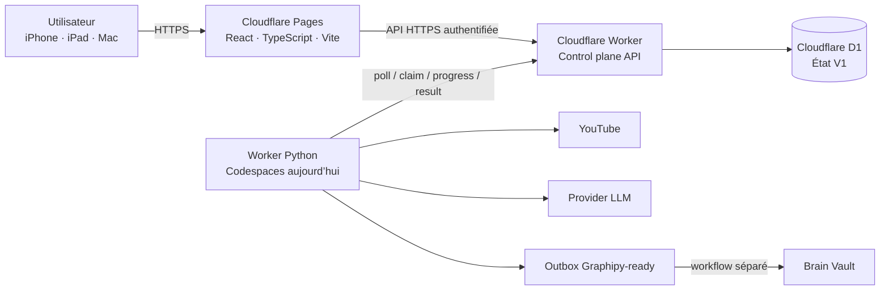
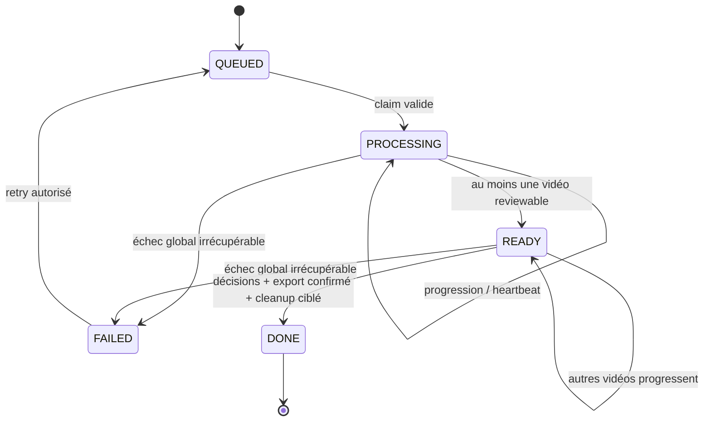
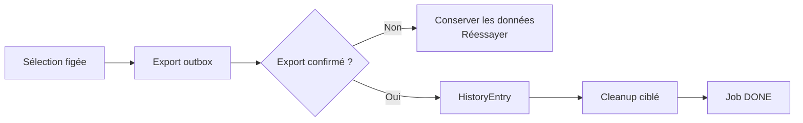

Status: ARCHITECTURE FROZEN FOR V1

# Summarizer Web V1 — Architecture

## 1. Objectif et autorité

Ce document fige l’architecture de Summarizer Web V1. Il traduit la logique produit autoritaire de [UI_UX_SPEC.md](UI_UX_SPEC.md) en frontières techniques sans modifier le pipeline Python existant.

Il complète, sans les remplacer :

- [ARCHITECTURE.md](ARCHITECTURE.md), qui décrit le pipeline local actuel ;
- [PIPELINE.md](PIPELINE.md), qui décrit les traitements YouTube et PDF ;
- [SAFETY.md](SAFETY.md), qui fixe les règles de sécurité du dépôt ;
- [UI_UX_SPEC.md](UI_UX_SPEC.md), qui reste la source de vérité pour tout comportement visible.

La V1 doit rendre possible le parcours Home → traitement → Review progressive → fiche → Note → décision → finalisation → History, tout en gardant le moteur Python remplaçable et le frontend indépendant de la machine qui l’exécute.

## 2. Statut des informations

### Décisions validées

Le brief d’architecture fourni pour cette phase valide explicitement :

- GitHub comme source du code et de son historique ;
- GitHub Codespaces comme environnement de développement distant utilisable depuis iPad ;
- Cloudflare comme couche Web et control plane permanente ;
- React, TypeScript et Vite pour le frontend ;
- Cloudflare Pages pour la livraison du frontend ;
- un Cloudflare Worker pour l’API du control plane ;
- Cloudflare D1 pour l’état durable minimal de la V1 ;
- un worker Python sortant et remplaçable pour exécuter le pipeline ;
- le pipeline Python actuel comme source de vérité métier ;
- une communication HTTPS machine-readable, sans parsing de stdout ;
- un traitement playlist vidéo par vidéo ;
- une interface disponible avant la fin complète du job ;
- le remplacement futur du worker Codespaces par un Mac mini, puis éventuellement un VPS ou un pool de workers ;
- l’absence de PDF dans le produit Web V1 ;
- la conservation intacte du pipeline PDF local.

### Faits vérifiés dans le code

L’inspection du dépôt confirme :

- `src.pipeline.run_youtube_source` détecte actuellement vidéo ou playlist ;
- `src.pipeline.run_playlist` traite les vidéos séquentiellement ;
- une exception vidéo est enregistrée puis la boucle continue ;
- `src.storage.manifest.JobManifest` persiste un statut par vidéo en JSON local ;
- `src.storage.youtube_library.YouTubeLibrary` conserve un transcript canonique par identifiant vidéo ;
- `src.summarizers.video_summarizer.VideoSummarizer` réutilise le routeur et la factory LLM ;
- `src.exporters.graphipy.export_graphipy_ready` constitue la frontière d’export existante ;
- `src.storage.retention.safe_delete` borne les suppressions à `cache/` et `output/` ;
- le transcript texte canonique supprime aujourd’hui les timestamps, tandis que la source SRT/VTT est conservée localement ;
- le choix CLI Écarter peut supprimer immédiatement le Markdown, comportement qui ne peut pas être repris tel quel pour le Web avec Undo ;
- aucun frontend, control plane, schéma D1 ou adaptateur Web n’existe encore dans le dépôt.

### Point documentaire manquant

Le dépôt ne contenait avant cette phase aucune trace de la configuration exacte des domaines, routes et politiques Cloudflare. Ces paramètres opérationnels restent ouverts. La topologie fonctionnelle décrite ci-dessous est unique ; ses identifiants de déploiement ne doivent pas être inventés dans le code.

## 3. Contraintes V1

### Fonctionnelles

- Sources Web : vidéo YouTube et playlist YouTube uniquement.
- Une vidéo produit une fiche, un résumé, un transcript et une Note unique.
- Une vidéo prête devient reviewable sans attendre la fin de la playlist.
- Une erreur vidéo n’arrête pas les vidéos suivantes.
- Garder, Écarter et Undo sont persistants.
- Terminer exporte avant tout cleanup.
- History reste un journal léger.

### Techniques

- Le navigateur n’exécute jamais Python, yt-dlp ou un appel LLM privé.
- Le frontend ne connaît jamais l’adresse physique du worker de traitement.
- Le worker peut disparaître puis reprendre sans corrompre le job.
- Les événements de progression sont structurés.
- Aucune interface ne dépend de stdout ou des logs terminaux.
- Aucun secret privé n’est compilé dans le frontend.
- Aucune donnée utilisateur, transcription, sortie, clé ou cookie n’est committé.
- Le pipeline CLI et le pipeline PDF existants continuent de fonctionner.

### Non-objectifs

- multi-tenant complet ;
- facturation ;
- Kubernetes ou orchestration distribuée ;
- Kafka, Redis, Celery ou autre broker ;
- GraphQL ;
- WebSocket par défaut ;
- RAG ou base vectorielle ;
- workflow PDF Web ;
- bibliothèque de connaissances concurrente au Brain Vault.

## 4. Topologie V1



La règle structurante est que toutes les connexions de traitement partent du worker vers le control plane. La V1 n’expose pas de serveur entrant sur le Codespace, le Mac mini ou le futur VPS. Aucun tunnel vers la machine de traitement n’est requis pour le flux produit.

Le frontend appelle uniquement le control plane Cloudflare. Le control plane conserve l’état durable minimal et remet des jobs à un worker authentifié. Le worker appelle le pipeline local, puis publie des événements et résultats structurés.

## 5. Composants et responsabilités

| Composant | Responsabilité | Ne doit pas faire |
| --- | --- | --- |
| GitHub | Code, branches, revue et CI | Stocker `.env`, cookies, transcripts ou outputs utilisateur |
| Codespaces | Développement distant et worker temporaire de V1 | Devenir une dépendance permanente du frontend |
| Cloudflare Pages | Livrer la SPA React | Connaître les secrets LLM ou exécuter Python |
| Cloudflare Worker | API, validation, autorisation, jobs, notes, décisions, History | Télécharger YouTube ou appeler le LLM |
| Cloudflare D1 | État durable minimal et concurrence | Devenir le Brain Vault ou un stockage illimité d’artefacts |
| Worker Python | Réclamer un job et exécuter le pipeline | Servir directement le navigateur |
| Pipeline Python | Extraction, transcript, résumé, export | Connaître les composants visuels Web |
| Provider LLM | Générer le résumé via l’abstraction existante | Être appelé depuis le navigateur |
| Outbox Graphipy | Préparer un transfert vérifiable | Inventer l’arborescence interne du Brain Vault |
| Brain Vault | Conserver et organiser la connaissance | Piloter le job Web ou remplacer Review |

## 6. Frontend

### Stack

- React ;
- TypeScript ;
- Vite ;
- application statique livrée par Cloudflare Pages.

La sélection précise des composants UI, du routeur, de la bibliothèque de requêtes et de la bibliothèque motion reste ouverte jusqu’aux phases prévues dans le plan.

### Routes produit

- `/` : Home ;
- `/review` : Review ;
- `/review/:videoId` : fiche vidéo ;
- `/history` : History.

La forme exacte des URLs peut évoluer sans modifier le contrat produit, mais ces destinations restent les seules destinations principales de la V1.

### Accès aux données

Le frontend :

- crée une Source via l’API ;
- lit l’état d’un Job et ses vidéos ;
- lit les vidéos READY ;
- édite la Note avec contrôle de version ;
- enregistre Garder, Écarter et Annuler ;
- déclenche Terminer ;
- lit History.

Il n’accède jamais directement à D1, au worker Python, au système de fichiers ou au provider LLM.

### Actualisation

La V1 utilise du polling HTTP borné pour les jobs actifs. Le polling ralentit ou s’arrête lorsque :

- le job est terminal ;
- l’onglet est en arrière-plan ;
- aucune session active n’existe ;
- le réseau est indisponible.

WebSocket et Server-Sent Events ne sont pas nécessaires pour satisfaire la V1. Ils ne pourront être introduits qu’après mesure d’un problème réel.

## 7. Control plane Cloudflare

Le control plane est un Cloudflare Worker TypeScript lié à une base D1.

Il est responsable de :

- valider une URL et créer la Source ;
- créer le Job et ses enregistrements vidéo ;
- exposer un contrat de claim avec lease ;
- recevoir la progression, le résultat ou l’erreur du worker ;
- rendre une vidéo READY immédiatement ;
- stocker et versionner la Note ;
- enregistrer les décisions de Review ;
- fournir Undo ;
- coordonner la finalisation ;
- créer un HistoryEntry léger ;
- exposer des messages utilisateur nettoyés ;
- conserver des codes de diagnostic sans secret.

Il n’est pas responsable de :

- lancer yt-dlp ;
- stocker des cookies YouTube ;
- appeler Gemini, Anthropic ou un endpoint compatible OpenAI ;
- exécuter le pipeline PDF ;
- écrire directement dans le Brain Vault.

## 8. Worker de traitement

Le worker est un processus Python sortant. Il est démarré dans l’environnement de traitement disponible : Codespaces en V1 initiale, Mac mini plus tard, VPS ou container ensuite.

Boucle conceptuelle :

1. s’authentifier auprès du control plane ;
2. réclamer un job QUEUED ;
3. recevoir une lease bornée ;
4. confirmer PROCESSING ;
5. exécuter le pipeline vidéo par vidéo ;
6. publier la progression structurée ;
7. publier chaque vidéo READY dès disponibilité ;
8. publier les erreurs isolées ;
9. renouveler la lease pendant un traitement long ;
10. terminer ou relâcher proprement le job.

Le worker ne reçoit pas de requête du navigateur et n’a pas besoin d’adresse publique stable.

## 9. Adaptateur du pipeline Python

Une frontière Python minimale encapsule le pipeline existant. Elle ne le réimplémente pas.

Entrée conceptuelle :

```json
{
  "job_id": "job_...",
  "source_url": "https://youtube.com/...",
  "source_type": "youtube",
  "requested_at": "RFC3339"
}
```

Sorties conceptuelles :

- événements de progression ;
- résultat structuré par vidéo ;
- erreur structurée ;
- résultat final du job.

Le point d’intégration préféré est l’ajout d’un observateur optionnel aux fonctions existantes. Sans observateur, le comportement CLI reste identique. Avec observateur, le pipeline émet des événements après les transitions réelles, notamment après la persistance du statut d’une vidéo.

Il est interdit de :

- dupliquer la boucle playlist dans TypeScript ;
- parser les messages Rich ou stdout ;
- appeler des fonctions fictives qui n’existent pas dans le dépôt ;
- coupler le pipeline à D1 ou à Cloudflare.

## 10. Pipeline Python existant

La source de vérité métier reste :

- `src/pipeline.py` pour l’orchestration ;
- `src/extractors/youtube.py` pour YouTube ;
- `src/storage/youtube_library.py` pour le transcript canonique ;
- `src/summarizers/video_summarizer.py` pour le résumé ;
- `src/llm/` pour les providers et le routing ;
- `src/storage/manifest.py` pour le manifest local ;
- `src/exporters/graphipy.py` pour l’export ;
- `src/storage/retention.py` pour les suppressions bornées.

Les extensions Web doivent rester optionnelles pour le CLI. Les tests du pipeline PDF doivent rester verts après chaque changement commun.

## 11. LLM

Le worker appelle exclusivement la factory LLM existante. La chaîne reste :

Transcript → VideoSummarizer → ModelRouter → LLM factory → provider.

Le provider concret peut être Gemini aujourd’hui et changer par configuration. Le contrat Web ne contient ni nom de provider obligatoire, ni clé, ni appel direct.

Le modèle utilisé peut être conservé comme provenance diagnostique ou d’export. Il ne devient pas un réglage visible de l’UX V1.

## 12. Stockage et état

### D1

D1 conserve uniquement l’état nécessaire au produit Web :

- Sources et métadonnées ;
- Jobs et leases ;
- vidéos et progression ;
- résumés structurés ;
- blocs de transcript horodatés nécessaires à la fiche ;
- une Note par vidéo ;
- décision de Review ;
- statut de finalisation et d’export ;
- HistoryEntry léger ;
- événements diagnostiques bornés.

Les transcripts sont divisés en blocs ordonnés. Cette structure préserve les timestamps et évite de dépendre d’une ligne D1 unique pour une source longue. La documentation officielle D1 fixe actuellement une limite de 2 MB par chaîne, BLOB ou ligne ; les validations d’entrée doivent rester nettement sous cette limite.

### Stockage local du worker

Le worker conserve les artefacts nécessaires au pipeline dans les emplacements locaux existants :

- `library/youtube/` pour le transcript canonique ;
- `cache/` pour le temporaire ;
- `output/videos/` pour les résultats ;
- `output/graphipy_ready/` pour l’outbox explicite.

Ces artefacts ne sont jamais servis directement au navigateur et ne sont jamais versionnés.

### Pas de nouveau stockage lourd

La V1 n’ajoute ni ORM lourd, ni base vectorielle, ni data lake. Si un artefact dépasse les limites raisonnables de D1, il est rejeté proprement ou découpé selon le contrat ; l’ajout d’un stockage objet constitue une décision ultérieure explicite.

## 13. Modèle conceptuel minimal

### Source

- identifiant ;
- URL originale ;
- type détecté : vidéo ou playlist ;
- titre quand disponible ;
- date de création ;
- statut global.

### Job

- identifiant ;
- Source associée ;
- état ;
- progression agrégée ;
- identifiant du worker ayant la lease ;
- expiration de lease ;
- tentative ;
- timestamps ;
- erreur publique et code diagnostic éventuels.

### Video

- identifiant interne ;
- identifiant YouTube ;
- ordre dans la playlist ;
- titre, URL, chaîne et durée si disponibles ;
- état de traitement ;
- étape et progression ;
- résumé ;
- provenance ;
- erreur utilisateur et code diagnostic.

### Note

- identifiant vidéo unique ;
- texte utilisateur ;
- liste ordonnée d’extraits avec texte et timestamp ;
- version monotone ;
- date de mise à jour.

La contrainte logique est un-à-un entre Video et Note.

### ReviewDecision

- vidéo ;
- valeur : PENDING, KEPT ou DISCARDED ;
- version ;
- date ;
- décision précédente nécessaire à Undo.

### HistoryEntry

- Source ;
- date de fin ;
- nombre total, traité, gardé, écarté et échoué ;
- statut final ;
- statut d’export ;
- référence minimale vers les éléments encore consultables.

## 14. Contrats API conceptuels

Les chemins exacts pourront être renommés avant l’implémentation, mais les capacités sont figées.

### Navigateur vers control plane

| Capacité | Méthode conceptuelle | Propriété essentielle |
| --- | --- | --- |
| Créer une Source | `POST /sources` | Idempotency-Key, URL validée |
| Lire un Job | `GET /jobs/:id` | Progression agrégée et vidéos |
| Lister Review | `GET /review` | Vidéos READY uniquement |
| Lire une fiche | `GET /videos/:id` | Résumé, Note, transcript horodaté |
| Sauver une Note | `PUT /videos/:id/note` | Version obligatoire |
| Décider | `PUT /videos/:id/decision` | Idempotent et versionné |
| Annuler | `POST /videos/:id/decision/undo` | Restaure la décision précédente |
| Finaliser | `POST /jobs/:id/finalize` | Idempotency-Key |
| Lire History | `GET /history` | Projection légère |

### Worker vers control plane

| Capacité | Méthode conceptuelle | Propriété essentielle |
| --- | --- | --- |
| Réclamer | `POST /worker/jobs/claim` | Lease atomique |
| Renouveler | `POST /worker/jobs/:id/heartbeat` | Worker et lease vérifiés |
| Publier progression | `POST /worker/jobs/:id/events` | Événement idempotent |
| Publier résultat vidéo | `PUT /worker/jobs/:id/videos/:id/result` | Rend READY une seule fois |
| Publier erreur vidéo | `PUT /worker/jobs/:id/videos/:id/error` | N’arrête pas la playlist |
| Terminer traitement | `POST /worker/jobs/:id/complete` | État global cohérent |
| Confirmer export | `POST /worker/jobs/:id/export-result` | Preuve avant cleanup |

Tout endpoint mutable accepte un identifiant de requête ou une clé d’idempotence. Les réponses d’erreur séparent message public et code diagnostic.

## 15. Progression machine-readable

Format minimal d’événement :

```json
{
  "event_id": "evt_...",
  "job_id": "job_...",
  "video_id": "video_...",
  "status": "PROCESSING",
  "stage": "TRANSCRIPT",
  "progress": 0.5,
  "occurred_at": "RFC3339"
}
```

Règles :

- `event_id` est unique et rend la publication idempotente ;
- `progress` est compris entre 0 et 1 quand il est connu ;
- `stage` utilise un vocabulaire interne stable ;
- le frontend traduit ces états en microcopy utilisateur ;
- aucun secret, traceback ou contenu privé inutile n’apparaît dans l’événement ;
- une vidéo READY est publiée immédiatement, sans attendre la playlist.

## 16. Cycle de vie des jobs



Le statut global READY signifie que Review peut commencer. Il n’implique pas que toutes les vidéos sont terminées.

Chaque vidéo suit :

- QUEUED ;
- PROCESSING ;
- READY ;
- FAILED.

La décision Review est un axe séparé : PENDING, KEPT ou DISCARDED. DONE est réservé à la session finalisée afin de ne pas confondre traitement terminé et décision utilisateur.

## 17. Claim, lease et idempotence

Un worker réclame un job pour une durée bornée. Une claim valide associe atomiquement :

- le job ;
- un identifiant de worker ;
- un jeton de lease opaque ;
- une date d’expiration ;
- un numéro de tentative.

Seul le détenteur de la lease active peut publier progression et résultats. Le heartbeat prolonge la lease. Une lease expirée rend le job réclamable sans effacer les résultats vidéo déjà persistés.

La reprise saute les vidéos déjà READY. Les publications répétées avec le même `event_id` ou la même clé d’idempotence ne créent pas de doublon.

Ce modèle fournit une idempotence raisonnable sans broker distribué.

## 18. Note et autosave

Une requête de sauvegarde contient :

- le contenu complet de la Note ou une représentation canonique ;
- les extraits avec timestamps ;
- la version de base connue par le client ;
- un identifiant de requête.

Le control plane applique la modification uniquement si la version de base correspond à la version courante. Il incrémente ensuite la version. Une réponse ancienne ne peut donc pas écraser silencieusement une Note plus récente.

En cas de conflit :

- le serveur retourne un conflit explicite ;
- le client conserve le brouillon local ;
- aucune donnée locale n’est effacée ;
- une récupération ou nouvelle tentative est proposée.

Le debounce exact et le mécanisme de brouillon local restent des détails d’implémentation frontend.

## 19. Review, Garder, Écarter et Undo

Garder et Écarter mettent à jour ReviewDecision. Écarter ne supprime aucun fichier à ce stade.

Undo restaure la décision précédente pendant la fenêtre UX prévue. La durée exacte est ouverte, mais l’API conserve assez d’état pour rendre l’action réellement réversible.

Les actions sont idempotentes : répéter la même décision ne crée pas de nouvel effet. Une décision et un Undo concurrents sont arbitrés par version monotone.

## 20. Finalisation

La finalisation suit impérativement :

1. geler l’ensemble des décisions de la session ;
2. construire l’export des vidéos KEPT ;
3. vérifier l’écriture de l’outbox ;
4. publier une confirmation d’export ;
5. créer ou compléter HistoryEntry ;
6. effectuer le cleanup ciblé autorisé ;
7. marquer le Job DONE.



Une nouvelle requête Terminer avec la même clé d’idempotence reprend ou retourne le résultat de la finalisation ; elle ne duplique pas l’export.

## 21. Brain Vault

Le mécanisme vérifié dans ce dépôt est l’export Graphipy-ready vers `output/graphipy_ready/`. La V1 réutilise cette frontière comme outbox locale du worker.

Chaque vidéo gardée transmet au minimum :

- titre ;
- URL ;
- identifiant YouTube ;
- chaîne si disponible ;
- playlist et ordre si disponibles ;
- résumé ;
- Note ;
- extraits et timestamps ;
- transcript ou référence adaptée ;
- date ;
- provenance utile ;
- modèle utilisé si pertinent.

L’organisation interne ultérieure dans le Brain Vault n’appartient pas à Summarizer. Le transfert physique depuis un worker distant vers le Vault reste derrière l’interface d’outbox et doit être validé avant la phase Brain Vault.

## 22. Cleanup et rétention

Le cleanup est limité au job concerné. Il ne supprime jamais globalement :

- `input/` ;
- `output/` ;
- `cache/` ;
- `playlists/` ;
- `library/youtube/`.

Les transcripts canoniques locaux ne sont pas supprimés par la décision Écarter. Les artefacts temporaires et sorties du job peuvent être supprimés après export confirmé selon la politique de rétention.

D1 conserve History et la provenance minimale. Les gros blocs de transcript d’une session terminée peuvent être purgés après la période de reprise définie, sans effacer l’export confirmé ni la Note gardée.

## 23. Codespaces et environnement actuel

Codespaces remplit deux rôles temporaires :

- environnement de développement depuis iPad via VS Code Web ;
- machine d’exécution du worker Python pendant la première phase personnelle.

Un Codespace peut s’arrêter. Cette interruption est normale : la lease expire, le job reste durable dans D1 et un worker relancé reprend les vidéos non READY.

Les ports de développement restent privés. Le flux produit du worker est sortant et ne dépend pas d’un port Codespaces public.

L’état inspecté au début de cette phase ne contient aucun frontend, package Node, configuration Wrangler ou migration D1. Leur création appartient aux phases suivantes.

## 24. Mac mini futur

Le remplacement du worker Codespaces par le Mac mini ne change ni le frontend ni l’API.

Le Mac mini reçoit :

- le même runner Python ;
- les mêmes contrats JSON ;
- des secrets injectés localement ;
- un identifiant de worker propre ;
- l’accès local aux pipelines YouTube, puis PDF/OCR en V2.

La bibliothèque YouTube locale et les moteurs lourds peuvent résider sur le Mac mini sans être connus du control plane.

## 25. VPS, container ou pool futur

Un futur VPS ou container applique le même protocole claim/lease/heartbeat/result. Un pool utilise plusieurs identifiants de worker et la même claim atomique.

Cette possibilité ne justifie aucune orchestration distribuée en V1. Le contrat permet l’évolution ; l’infrastructure n’est pas construite avant nécessité.

## 26. V2 PDF

Le pipeline PDF reste local et intact en V1. La V2 pourra ajouter un type de Source PDF et un worker plus lourd derrière la même frontière.

Le modèle UX reste Source → Contenu → Résumé → Note → Décision. Le numéro de page remplace le timestamp. L’upload, le stockage de fichier et le lecteur PDF nécessiteront une décision d’architecture séparée.

## 27. Sécurité

### Secrets

- Les clés LLM restent uniquement dans l’environnement du worker.
- Les credentials machine-to-machine restent uniquement dans les secrets du worker et de Cloudflare.
- Aucun secret ne porte un préfixe public Vite.
- D1 ne stocke pas de clé LLM, de cookie YouTube ni de secret d’accès en clair.
- `.env`, `cookies.txt`, transcripts, outputs et caches restent exclus des commits.

### Accès

- L’utilisateur doit être authentifié avant toute lecture ou mutation de données.
- Le worker utilise une identité de service distincte et révocable.
- Les routes navigateur et worker ont des autorisations séparées.
- Le control plane refuse un résultat provenant d’un worker qui ne détient pas la lease.

La configuration exacte de Cloudflare Access, des domaines et de la rotation des service tokens reste à consigner au moment du déploiement. Cloudflare documente les service tokens comme credentials dédiés aux systèmes automatisés ; aucun exemple de secret ne doit être repris dans le dépôt.

### Entrées et sorties

- URL normalisée et validée côté serveur ;
- tailles de payload bornées ;
- schémas JSON vérifiés ;
- contenu utilisateur traité comme donnée, jamais comme instruction système ;
- messages publics nettoyés ;
- diagnostics sans clé, cookie ou transcript complet ;
- permissions minimales par route.

## 28. Observabilité

Le control plane conserve des événements structurés et bornés :

- identifiant job et vidéo ;
- transition d’état ;
- stage ;
- tentative ;
- worker ;
- date ;
- code diagnostic ;
- durée utile.

Les logs ne contiennent pas :

- secrets ;
- cookies ;
- prompt complet ;
- transcript complet ;
- contenu intégral de la Note ;
- traceback brut envoyé au navigateur.

Les messages utilisateur restent simples. Les détails diagnostiques sont accessibles uniquement dans le contexte développeur approprié.

## 29. Failure modes

| Échec | Comportement attendu | Données préservées | Reprise |
| --- | --- | --- | --- |
| URL invalide | Refus avant création du job ou état FAILED clair | Aucune donnée inutile | Corriger l’URL |
| Codespace arrêté | Lease expire | Job, résultats READY, Notes | Relancer un worker |
| Transcript absent | Vidéo FAILED, playlist continue | Autres vidéos | Retry manuel si pertinent |
| Échec LLM | Vidéo FAILED ou retryable | Transcript local, autres vidéos | Retry borné |
| API indisponible | Worker garde le résultat local et réessaie | Artefacts locaux | Backoff puis republication idempotente |
| Publication dupliquée | Même résultat retourné | État unique | Idempotency-Key |
| Autosave hors ordre | Conflit de version | Brouillon local et dernière version serveur | Réconciliation / retry |
| Décision accidentelle | Undo | Vidéo et décision précédente | Annuler |
| Export Vault échoué | Finalisation non terminée, aucun cleanup | Toutes les vidéos gardées | Réessayer export |
| Cleanup échoué | Export reste confirmé, job diagnostic | Export et History | Retry ciblé |
| Une vidéo échoue | Playlist continue | Vidéos réussies | Retry de la vidéo |

## 30. Baseline et contradictions techniques

### Baseline du 20 septembre 2026

- dans le checkout local déjà modifié : 103 tests passent, Black passe sur 74 fichiers, Ruff passe et Mypy signale 20 erreurs préexistantes dans 9 fichiers ;
- dans le worktree propre basé sur `origin/main`, utilisé pour la branche Web V1 : 87 tests passent, Black passe sur 62 fichiers, Ruff passe et Mypy signale 17 erreurs préexistantes dans 9 fichiers ;
- l’aide `runyoutube` fonctionne ;
- aucun test live YouTube/LLM n’a été lancé sans source de test dédiée ;
- aucun frontend ou composant Cloudflare n’existe encore.

### Contradictions à résoudre sans modifier l’UX

1. Le transcript texte canonique retire les timestamps. L’adaptateur Web devra produire et conserver des blocs horodatés depuis SRT/VTT sans casser le transcript texte existant.
2. Le CLI peut supprimer immédiatement un résumé écarté. Le Web doit enregistrer une décision réversible et reporter tout cleanup à la finalisation.
3. Le manifest local connaît essentiellement `pending`, `done`, `failed` et `kept`. Le contrat Web exige QUEUED, PROCESSING, READY, DONE, FAILED et une décision séparée.
4. Le pipeline écrit son statut après chaque vidéo, mais n’émet pas encore d’événement machine-readable au moment où elle devient prête.
5. L’export actuel écrit une copie Graphipy-ready, mais ne fournit pas encore de protocole de confirmation avant cleanup.
6. La branche locale inspectée contient un historique où des transcripts YouTube ont été suivis. La branche Web V1 doit partir de `origin/main`, qui n’inclut pas ces fichiers, et aucun nouveau commit ne doit les introduire.

## 31. Sources de vérification

### Dépôt

- `AGENTS.md` ;
- `AI_MAINTENANCE.md` ;
- `docs/UI_UX_SPEC.md` ;
- `docs/ARCHITECTURE.md` ;
- `docs/PIPELINE.md` ;
- `docs/SAFETY.md` ;
- `Readme.md` ;
- `.env.example` ;
- `requirements.txt` ;
- code sous `src/`, `config/`, `prompts/` et `tests/`.

### Documentation officielle externe

- [Cloudflare Pages pour Vite](https://developers.cloudflare.com/pages/framework-guides/deploy-a-vite3-project/) ;
- [comportement SPA de Cloudflare Pages](https://developers.cloudflare.com/pages/configuration/serving-pages/) ;
- [limites de Cloudflare D1](https://developers.cloudflare.com/d1/platform/limits/) ;
- [service tokens Cloudflare Access](https://developers.cloudflare.com/cloudflare-one/access-controls/service-credentials/service-tokens/) ;
- [sécurité et ports GitHub Codespaces](https://docs.github.com/en/codespaces/reference/security-in-github-codespaces).

Les limites externes sont vérifiées au moment de ce document et doivent être revérifiées avant déploiement.

## FROZEN ARCHITECTURE DECISIONS

- UX de [UI_UX_SPEC.md](UI_UX_SPEC.md) autoritaire ;
- Web V1 YouTube uniquement ;
- pipeline PDF conservé mais absent du Web V1 ;
- frontend React + TypeScript + Vite ;
- frontend statique sur Cloudflare Pages ;
- API/control plane dans un Cloudflare Worker ;
- état durable minimal dans Cloudflare D1 ;
- navigateur → control plane uniquement ;
- aucun secret LLM dans le frontend ;
- worker Python séparé, remplaçable et non exposé directement ;
- communication worker initiée en HTTPS sortant ;
- aucun tunnel entrant requis pour le traitement V1 ;
- polling HTTP pour la progression V1 ;
- aucun WebSocket sans besoin mesuré ;
- pipeline Python actuel conservé comme moteur métier ;
- abstraction LLM actuelle conservée ;
- playlist traitée vidéo par vidéo ;
- erreur vidéo isolée ;
- résultat vidéo publié READY dès disponibilité ;
- progression et erreurs machine-readable ;
- claim avec lease et publication idempotente ;
- états QUEUED, PROCESSING, READY, DONE et FAILED ;
- état de décision séparé PENDING, KEPT ou DISCARDED ;
- une Video = une Note ;
- autosave protégé par version monotone ;
- Écarter ne supprime rien immédiatement ;
- Undo supporté par le modèle de données ;
- finalisation dans l’ordre sélection → export → confirmation → cleanup ;
- outbox Graphipy-ready comme frontière Brain Vault existante ;
- History léger ;
- cleanup ciblé au job ;
- Codespaces comme environnement de développement et worker temporaire ;
- Mac mini puis VPS/container possibles sans changement du frontend ou du contrat ;
- aucun artefact utilisateur ou secret dans Git.

## OPEN IMPLEMENTATION DETAILS

- noms exacts des domaines et routes Cloudflare ;
- identifiants des projets Pages, Worker et D1 ;
- politique Cloudflare Access utilisateur exacte ;
- format et rotation exacts des credentials worker ;
- fréquence, backoff et jitter précis du polling ;
- durées de lease et de heartbeat ;
- nombre maximal de retries par stage ;
- schéma SQL et noms exacts des migrations D1 ;
- outil de validation des contrats TypeScript/Python ;
- bibliothèque frontend de requêtes ;
- routeur React exact ;
- bibliothèque UI et motion ;
- debounce exact de l’autosave ;
- durée exacte de l’Undo ;
- taille exacte des blocs de transcript ;
- durée de rétention D1 après finalisation ;
- transfert physique de l’outbox depuis un worker distant vers le Brain Vault ;
- format détaillé final de l’export Graphipy-ready enrichi ;
- mécanisme V2 de stockage et lecture PDF.

Ces détails peuvent évoluer sans remettre en cause l’architecture. Toute modification d’une décision Frozen exige une validation explicite et une mise à jour de ce document.
