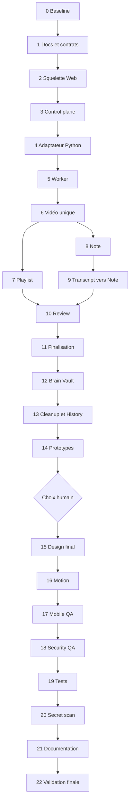

Status: READY FOR PHASED EXECUTION

# Summarizer Web V1 — Plan d’implémentation

## 1. Objet

Ce plan transforme [WEB_V1_ARCHITECTURE.md](WEB_V1_ARCHITECTURE.md) en séquence d’exécution vérifiable. [UI_UX_SPEC.md](UI_UX_SPEC.md) reste autoritaire pour le comportement produit. Le pipeline local décrit par [ARCHITECTURE.md](ARCHITECTURE.md) et [PIPELINE.md](PIPELINE.md) doit rester fonctionnel pendant toute l’exécution.

Ce document permet à un nouvel agent de reprendre le travail sans redécouvrir l’architecture, sans développer sur `main` et sans intégrer les artefacts privés présents dans certains états locaux du dépôt.

## 2. Règles d’exécution

### Ordre

- Exécuter les phases dans l’ordre.
- Ne passer à la phase suivante que lorsque les critères d’acceptation et les tests de la phase courante sont satisfaits.
- Un échec préexistant peut être documenté et isolé ; un nouvel échec introduit par la phase doit être corrigé.
- Ne pas attendre une validation humaine pour chaque micro-étape technique non destructive.
- Demander une validation avant toute modification d’une décision Frozen, choix visuel A/B/C, opération destructive ou changement architectural majeur.

### Git

- Branche de travail cible : `feat/web-v1`, créée depuis `origin/main`.
- Ne pas utiliser la branche locale divergente `bibliotheque-de-babbel` comme base du Web V1.
- Ne jamais utiliser `git reset --hard`, `git clean -fd`, `git push --force` ou `git branch -D`.
- Stager des chemins explicites.
- Vérifier le diff et les secrets avant chaque commit.
- Ne jamais committer `.env`, cookies, transcripts, PDF, outputs, caches ou playlists locales.

### Commits

Les commits restent petits et cohérents. Séquence recommandée :

1. `docs: freeze web v1 architecture`
2. `feat(web): add application shell`
3. `feat(control-plane): add source and job lifecycle`
4. `feat(pipeline): expose structured web events`
5. `feat(worker): add claim and processing runner`
6. `feat(web): support single youtube video`
7. `feat(web): add progressive playlist processing`
8. `feat(notes): add versioned autosave`
9. `feat(notes): add timestamped transcript excerpts`
10. `feat(review): add keep discard and undo`
11. `feat(finalize): add safe export and cleanup`
12. commits design et QA séparés après validation humaine.

### Compte rendu de phase

Après chaque phase importante, produire :

```text
PHASE TERMINÉE

Fichiers modifiés :
...

Fonctionnel :
...

Tests :
...

Problèmes :
...

Prochaine phase :
...
```

## 3. Matrice des phases

| Phase | Objet | Validation humaine | Statut |
| --- | --- | --- | --- |
| 0 | Baseline | Non, sauf risque destructif | Terminée et documentée |
| 1 | Docs et contrats | Si décision Frozen manquante | Terminée par les trois docs V1 |
| 2 | Squelette Web | Non | Terminée et testée |
| 3 | Control plane | Non, dans l’architecture figée | Terminée et testée localement |
| 4 | Adaptateur Python | Non | Terminée et testée |
| 5 | Worker | Non | Terminée et testée localement |
| 6 | Vidéo unique | Non | Terminée et testée localement |
| 7 | Playlist progressive | Non | Terminée et testée localement |
| 8 | Note et autosave | Non | À faire |
| 9 | Transcript vers Note | Validation UX si conflit iOS | À faire |
| 10 | Review | Non | À faire |
| 11 | Finalisation | Non | À faire |
| 12 | Brain Vault | Oui si la frontière réelle diffère | À faire |
| 13 | Cleanup et History | Oui avant suppression nouvelle | À faire |
| 14 | Prototypes A/B/C | Choix humain obligatoire | À faire |
| 15 | Design final | Choix A/B/C requis | Bloquée par phase 14 |
| 16 | Revue motion | Non | À faire après design fonctionnel |
| 17 | QA mobile | Non | À faire |
| 18 | QA sécurité | Non | À faire |
| 19 | Suite de tests | Non | À faire |
| 20 | Secret scan | Non | À faire |
| 21 | Documentation opératoire | Non | À faire |
| 22 | Validation finale | Oui pour promotion/merge si requis | À faire |

## PHASE 0 — Baseline du dépôt

### Objectif

Comprendre l’état réel avant toute implémentation, identifier les risques préexistants et produire une base de comparaison reproductible.

### Fichiers concernés

- `AGENTS.md`
- `AI_MAINTENANCE.md`
- `docs/UI_UX_SPEC.md`
- `docs/ARCHITECTURE.md`
- `docs/PIPELINE.md`
- `docs/SAFETY.md`
- `Readme.md`
- `.env.example`
- `requirements.txt`
- `pyproject.toml`
- `.github/workflows/ci.yml`
- `src/pipeline.py`
- `src/menu.py`
- `src/storage/manifest.py`
- `src/extractors/`
- `src/summarizers/`
- `src/llm/`
- `src/exporters/`
- `config/`
- `prompts/`
- `tests/`

### Dépendances

- environnement Python local existant ;
- aucun accès LLM nécessaire ;
- aucun déploiement.

### Changements

Aucun changement de code. Inspection, tests et documentation uniquement.

### Résultats observés le 20 septembre 2026

- Branche courante initiale : `bibliotheque-de-babbel`.
- Divergence avec `origin/main` : 9 commits de chaque côté.
- Working tree déjà modifié avant la tâche.
- `origin/main` ne contient aucun fichier sous `library/youtube/`.
- La branche courante suit 1 792 fichiers sous `library/youtube/`, situation incompatible avec la politique de confidentialité et exclue de la branche Web V1.
- Dans le checkout local déjà modifié : 103 tests passent, Black passe sur 74 fichiers, Ruff passe et Mypy échoue avec 20 erreurs préexistantes dans 9 fichiers.
- Dans le worktree propre basé sur `origin/main`, utilisé pour la branche Web V1 : 87 tests passent, Black passe sur 62 fichiers, Ruff passe et Mypy échoue avec 17 erreurs préexistantes dans 9 fichiers.
- L’aide `runyoutube` fonctionne.
- Le scan global signale 638 chaînes hexadécimales à forte entropie : 637 dans des métadonnées locales de bibliothèque et une dans une fixture golden. Aucun de ces fichiers de bibliothèque ne doit entrer dans la nouvelle branche.
- Aucun test YouTube ou LLM live n’a été lancé sans fixture publique dédiée et sans nécessité produit.

### Critères d’acceptation

- État Git compris et non détruit.
- Base propre choisie pour le Web V1.
- Pipeline réel et noms de fonctions vérifiés.
- Tests, format, lint, typecheck et secret scan exécutés.
- Échecs préexistants séparés des futurs changements.
- Aucun fichier privé ajouté.

### Tests

- `python -m pytest -q` : 103 réussites dans le checkout local modifié ; 87 sur la base propre `origin/main`.
- `python -m black --check src tests` : réussite dans les deux états.
- `python -m ruff check src tests` : réussite dans les deux états.
- `python -m mypy src` : 20 erreurs préexistantes dans le checkout local ; 17 sur la base propre `origin/main`.
- `./runyoutube --help` : réussite.
- `detect-secrets scan` sur les fichiers suivis ou non ignorés : findings de hashes documentés.

### Risques

- Embarquer accidentellement l’historique de la branche locale et ses transcripts.
- Attribuer au Web V1 les erreurs Mypy déjà présentes.
- Scanner ou afficher du contenu privé inutilement.

### Condition de passage

Créer ou utiliser `feat/web-v1` depuis `origin/main`, puis stager uniquement des chemins explicites. Cette condition est obligatoire avant tout commit ou push.

## PHASE 1 — Documentation et contrats conceptuels

### Objectif

Figer l’UX, l’architecture et la séquence d’exécution avant toute modification du code métier.

### Fichiers concernés

- `docs/UI_UX_SPEC.md`
- `docs/WEB_V1_ARCHITECTURE.md`
- `docs/WEB_V1_IMPLEMENTATION_PLAN.md`

### Dépendances

- Phase 0 terminée ;
- brief UX autoritaire ;
- décisions d’architecture fournies ;
- inspection du code réel.

### Changements

- Documenter la topologie Pages → Worker API → D1 ↔ worker Python.
- Définir les responsabilités et interdits de chaque composant.
- Définir Source, Job, Video, Note, ReviewDecision et HistoryEntry.
- Définir le cycle QUEUED, PROCESSING, READY, DONE, FAILED.
- Définir claim, lease, idempotence, autosave versionné, Undo et finalisation sûre.
- Séparer décisions Frozen et détails ouverts.

### Critères d’acceptation

- Les trois documents se lient sans se dupliquer.
- Aucun détail UX Frozen n’est rediscuté.
- Aucune fonction inexistante n’est présentée comme actuelle.
- Les contradictions code/UX sont explicites.
- Les choix non prouvés sont dans OPEN IMPLEMENTATION DETAILS.
- Aucun code métier n’est modifié.

### Tests

- `git diff --check` sur les trois documents.
- Vérification des liens Markdown locaux.
- Vérification de la présence des sections Frozen et Open.
- Scan de secrets limité au diff.

### Risques

- Transformer une hypothèse de déploiement en décision.
- Dupliquer `ARCHITECTURE.md`, `PIPELINE.md` ou `UI_UX_SPEC.md`.
- Mélanger configuration Cloudflare et architecture fonctionnelle.

### Condition de passage

Documents relus, commités seuls sur la branche dédiée et poussés. Aucun squelette Web ne commence dans le même commit.

## PHASE 2 — Squelette Web

### Objectif

Créer une application React + TypeScript + Vite minimale qui démarre et expose Home, Review et History sans logique métier dupliquée.

### Fichiers concernés

- `web/package.json`
- `web/package-lock.json` ou lockfile retenu
- `web/tsconfig*.json`
- `web/vite.config.ts`
- `web/index.html`
- `web/src/main.tsx`
- `web/src/App.tsx`
- `web/src/routes/`
- `web/src/styles/`
- `.gitignore`
- éventuelle configuration Codespaces existante, sans secret.

### Dépendances

- Phase 1 validée ;
- version Node documentée ;
- gestionnaire de paquets choisi une seule fois.

### Changements

- Initialiser Vite React TypeScript dans `web/`.
- Créer les routes Home, Review, History et fiche vidéo.
- Ajouter un client API vide ou mocké derrière une interface.
- Ajouter des états de chargement et d’erreur minimaux.
- N’ajouter aucune clé privée ni logique YouTube.
- Conserver le style volontairement neutre avant les prototypes.

### Critères d’acceptation

- L’application démarre localement.
- Les routes sont accessibles directement et par navigation.
- Un refresh d’une route SPA fonctionne dans la configuration locale.
- Aucun appel LLM ou pipeline depuis le navigateur.
- Aucun composant visuel ne fige la direction A/B/C.

### Tests

- commande de test réellement définie dans `web/package.json` ;
- lint TypeScript ;
- build Vite ;
- test de navigation Home → Review → History ;
- recherche de préfixes de secrets privés dans le bundle.

### Risques

- Installer une bibliothèque lourde sans besoin.
- Construire des données mock incompatibles avec les futurs contrats.
- Commencer le polish visuel avant le fonctionnement.

### Condition de passage

Build reproductible et routes vertes, sans warning de secret et sans logique métier dupliquée.

## PHASE 3 — Control plane Cloudflare

### Objectif

Créer l’API minimale et la persistance D1 pour Sources, Jobs, Video, Note, ReviewDecision et HistoryEntry.

### Fichiers concernés

- `cloudflare/package.json`
- `cloudflare/wrangler.toml` ou configuration Wrangler retenue
- `cloudflare/src/index.ts`
- `cloudflare/src/routes/`
- `cloudflare/src/domain/`
- `cloudflare/src/db/`
- `cloudflare/migrations/`
- `cloudflare/test/`
- schémas partagés sous `schemas/web-v1/`.

### Dépendances

- Phase 2 ;
- identifiants Cloudflare injectés hors Git ;
- décisions de domaines et d’accès consignées avant déploiement distant.

### Changements

- Créer Source et Job de façon idempotente.
- Persister états, progression, Note versionnée et décisions.
- Exposer les capacités API décrites dans l’architecture.
- Séparer routes navigateur et routes worker.
- Ajouter validation de schéma et limites de payload.
- Créer des migrations non destructives.
- Retourner message utilisateur et code diagnostic séparés.

### Critères d’acceptation

- Création répétée avec la même clé d’idempotence renvoie la même ressource.
- Une sauvegarde de Note avec version obsolète est refusée sans perte.
- Une décision répétée n’est pas dupliquée.
- D1 local se reconstruit depuis zéro.
- Aucune clé LLM ou cookie ne figure dans D1 ou dans le bundle.

### Tests

- tests unitaires des handlers ;
- tests de migrations D1 sur base vide ;
- tests create/read/update/conflit ;
- tests de taille et URL invalide ;
- build et dry-run Wrangler si la commande existe dans le package.

### Risques

- Confondre D1 avec le stockage de connaissance permanent.
- Ajouter un ORM disproportionné.
- Exposer les routes worker au navigateur.

### Condition de passage

API locale entièrement testée avec D1 local, migrations reproductibles et autorisations séparées.

## PHASE 4 — Adaptateur Python

### Objectif

Exposer une frontière structurée entre les jobs Web et le pipeline actuel, sans réimplémenter le traitement YouTube.

### Fichiers concernés

- `src/pipeline.py`
- nouveau package `src/web_adapter/`
- `src/storage/manifest.py` si extension compatible nécessaire
- `src/converters/srt_to_text.py` ou nouveau convertisseur horodaté séparé
- `schemas/web-v1/`
- `tests/test_web_adapter.py`
- tests existants du pipeline.

### Dépendances

- contrats Phase 3 stabilisés ;
- pipeline local vert ;
- fixtures YouTube locales sans réseau.

### Changements

- Ajouter un observateur optionnel au pipeline.
- Émettre des événements structurés aux transitions réelles.
- Produire un résultat vidéo avec résumé, provenance et transcript horodaté.
- Préserver le transcript texte actuel et créer une représentation horodatée séparée.
- Mapper les exceptions en codes stables sans masquer la cause dans les logs développeur.
- Garder le CLI inchangé quand aucun observateur n’est fourni.

### Critères d’acceptation

- Aucun parsing de stdout.
- Une fixture playlist émet un événement READY par vidéo dans l’ordre réel.
- Une erreur vidéo émet FAILED puis la suivante continue.
- Le pipeline PDF ne change pas.
- Le CLI YouTube conserve ses sorties actuelles.

### Tests

- tests unitaires de mapping des événements ;
- tests de transcript horodaté SRT et VTT ;
- tests playlist avec une vidéo en erreur ;
- tests de compatibilité CLI ;
- suite Python complète, Black et Ruff.

### Risques

- Dépendre de `_process_video` comme API privée sans stabilisation.
- Dupliquer la boucle playlist.
- Perdre les timestamps lors de la conversion.

### Condition de passage

Le pipeline local produit des événements structurés optionnels avec tous les tests historiques verts.

## PHASE 5 — Worker Python

### Objectif

Créer le runner qui réclame un job, renouvelle sa lease, appelle l’adaptateur et publie événements, résultats et erreurs.

### Fichiers concernés

- nouveau package `src/worker/`
- `src/cli.py` pour une commande worker explicite si approprié
- `.env.example` pour noms de variables sans valeurs
- `tests/test_worker_runner.py`
- documentation opératoire ultérieure.

### Dépendances

- Phases 3 et 4 ;
- endpoint local du control plane ;
- identité de service injectée hors Git.

### Changements

- Implémenter claim, heartbeat, publication et complete.
- Ajouter backoff borné et arrêt propre.
- Conserver localement un résultat non publié jusqu’à confirmation.
- Vérifier la lease à chaque mutation distante.
- Reprendre les vidéos non READY après interruption.

### Critères d’acceptation

- Deux workers ne traitent pas simultanément la même lease.
- Un worker interrompu rend le job réclamable après expiration.
- Une publication répétée ne duplique pas le résultat.
- Les secrets ne sont ni loggués ni renvoyés.
- Aucun port entrant n’est nécessaire.

### Tests

- tests avec faux control plane ;
- tests d’expiration et renouvellement de lease ;
- tests d’arrêt entre traitement et publication ;
- test de duplicate event ;
- suite Python complète.

### Risques

- Perdre un résultat entre écriture locale et publication.
- Retry sans limite.
- Heartbeat trop fréquent ou trop lent.

### Condition de passage

Runner local résilient contre interruption simulée, sans job traité deux fois simultanément.

## PHASE 6 — YouTube vidéo unique de bout en bout

### Objectif

Valider le premier flux réel URL → Job → transcript → résumé → READY → fiche.

### Fichiers concernés

- frontend Home et fiche ;
- routes Source/Job/Video du control plane ;
- adaptateur et worker ;
- tests end-to-end et fixtures.

### Dépendances

- Phases 2 à 5 ;
- environnement de test LLM contrôlé ou client fake ;
- source publique de test approuvée pour le test live facultatif.

### Changements

- Brancher le collage d’URL.
- Afficher le retour immédiat et la progression.
- Publier et rendre la vidéo READY.
- Afficher titre, résumé et transcript.
- Mapper les erreurs utilisateur.

### Critères d’acceptation

- Happy path complet avec fake déterministe.
- URL invalide refusée proprement.
- Transcript absent produit une erreur actionnable.
- Échec extraction, LLM et publication sont distingués.
- Retry ne duplique pas la fiche.

### Tests

- tests API et UI ;
- test worker avec fake extractor/LLM ;
- test end-to-end local ;
- test live limité seulement si une source de test et les secrets sont disponibles.

### Risques

- Dépendre d’un test réseau instable.
- Afficher une erreur interne brute.
- Confondre READY et exporté.

### Condition de passage

Vidéo unique entièrement reviewable avec tests déterministes verts.

## PHASE 7 — Playlist progressive

### Objectif

Traiter une playlist vidéo par vidéo et rendre la première vidéo READY avant la fin globale.

### Fichiers concernés

- adaptateur pipeline ;
- worker ;
- modèle Job/Video D1 ;
- écran de traitement ;
- Review ;
- tests playlist.

### Dépendances

- Phase 6 stable.

### Changements

- Créer les vidéos ordonnées dès que la playlist est connue.
- Publier état et progression individuels.
- Rendre chaque résultat visible immédiatement.
- Continuer après une erreur locale.
- Calculer progression agrégée sans masquer les erreurs.

### Critères d’acceptation

- La première vidéo est ouverte pendant le traitement des suivantes.
- L’ordre de la playlist est conservé, y compris les doublons.
- Une vidéo FAILED n’arrête pas la boucle.
- Reprise ne retraite pas les vidéos READY.
- L’état global reste cohérent après interruption.

### Tests

- playlist de fixtures avec plusieurs délais ;
- erreur sur vidéo intermédiaire ;
- duplication d’une URL dans la playlist ;
- interruption puis reprise ;
- Review ouverte avant la fin.

### Risques

- Attendre la fin du job avant d’écrire D1.
- Écraser une occurrence dupliquée.
- Progression globale trompeuse.

### Condition de passage

Test end-to-end prouvant READY progressif et isolation des erreurs.

## PHASE 8 — Note et autosave

### Objectif

Implémenter une Note unique par vidéo avec autosave fiable et protection contre l’écrasement.

### Fichiers concernés

- modèle et route Note du control plane ;
- composants Note du frontend ;
- stockage local de brouillon ;
- tests concurrence et navigation.

### Dépendances

- Phase 6 ;
- contrat Note versionné.

### Changements

- Charger ou créer la Note unique.
- Sauvegarder avec version de base.
- Ajouter debounce et retry borné.
- Conserver un brouillon local lors des erreurs.
- Afficher un état de sauvegarde discret.

### Critères d’acceptation

- Une requête ancienne ne peut pas écraser une version récente.
- Changement de route rapide ne perd pas la saisie.
- Reconnexion reprend la sauvegarde.
- Rechargement restaure la dernière version confirmée et le brouillon éventuel.
- Aucun bouton Enregistrer.

### Tests

- réponses réseau volontairement réordonnées ;
- offline puis online ;
- fermeture/navigation simulée ;
- une seule Note par vidéo ;
- test clavier mobile ultérieur en Phase 17.

### Risques

- Faux état « Enregistré ».
- Conflit silencieux multi-onglets.
- Debounce qui ne flush jamais.

### Condition de passage

Suite de concurrence verte et démonstration d’aucune perte de saisie.

## PHASE 9 — Transcript vers Note

### Objectif

Permettre sélection → Ajouter à la note avec texte et timestamp, sans créer de système de cartes.

### Fichiers concernés

- représentation transcript horodatée ;
- fiche vidéo ;
- contrôle contextuel de sélection ;
- modèle Note ;
- tests desktop et mobile.

### Dépendances

- Phases 4 et 8 ;
- timestamps disponibles dans le résultat worker.

### Changements

- Découper le transcript en blocs lisibles et ordonnés.
- Préserver la sélection native desktop.
- Ajouter l’action unique « Ajouter à la note ».
- Ajouter l’extrait optimistement puis le sauvegarder.
- Préserver copie et comportements iOS natifs.

### Critères d’acceptation

- Texte et timestamp exacts arrivent dans la Note.
- Copier reste fonctionnel.
- Une erreur de sauvegarde ne retire pas l’extrait.
- Aucun menu multifonction.
- Aucun conflit avec le swipe de Review, absent de la fiche.

### Tests

- sélection partielle et multibloc desktop ;
- extrait en début et fin de vidéo ;
- duplication volontaire ;
- erreur réseau ;
- essais réels iPhone/iPad en Phase 17.

### Risques

- Source SRT/VTT absente pour les anciens transcripts.
- Menu natif iOS inaccessible.
- Timestamp approximatif après sélection multibloc.

### Condition de passage

Interaction desktop accessible et stratégie mobile testable sans régression de sélection native.

## PHASE 10 — Review, Garder, Écarter et Undo

### Objectif

Implémenter la décision rapide sur mobile et desktop sans suppression immédiate.

### Fichiers concernés

- écran Review ;
- modèle ReviewDecision ;
- endpoints decision/undo ;
- interactions clavier et swipe ;
- tests accessibilité et concurrence.

### Dépendances

- Playlist progressive disponible ;
- API de décision versionnée.

### Changements

- Boutons visibles Garder et Écarter.
- Flèches gauche/droite sur desktop hors champs de saisie.
- Swipe gauche/droite sur mobile.
- Undo temporaire.
- Aucune suppression physique.
- Aucun swipe décisionnel dans la fiche.

### Critères d’acceptation

- Boutons et clavier produisent le même état.
- Le swipe suit le doigt et peut être annulé avant seuil.
- Undo restaure la décision précédente.
- Une décision concurrente ne produit pas un état impossible.
- Le geste n’est jamais obligatoire.

### Tests

- clavier avec focus normal et dans la Note ;
- swipe sous et au-dessus du seuil ;
- reduced motion ;
- décision répétée ;
- Undo après Garder et après Écarter.

### Risques

- Swipe trop sensible.
- Raccourci déclenché pendant la saisie.
- Suppression héritée du CLI appelée par erreur.

### Condition de passage

Review entièrement utilisable sans geste et aucune suppression avant finalisation.

## PHASE 11 — Finalisation sûre

### Objectif

Implémenter Playlist terminée et Terminer avec ordre export → confirmation → cleanup.

### Fichiers concernés

- endpoint finalize ;
- état de finalisation D1 ;
- worker export ;
- écran de fin ;
- tests de reprise.

### Dépendances

- Toutes les vidéos terminales ou explicitement en erreur ;
- décisions enregistrées ;
- export local disponible.

### Changements

- Geler la sélection.
- Créer une commande d’export idempotente.
- Enregistrer confirmation ou échec.
- Interdire cleanup sans confirmation.
- Afficher le bilan et le CTA Terminer.

### Critères d’acceptation

- Double clic Terminer ne duplique pas l’export.
- Échec export conserve toutes les données gardées.
- Reprise après crash continue au bon stage.
- Le job ne devient DONE qu’après les étapes requises.

### Tests

- échec avant export ;
- échec après écriture avant confirmation ;
- confirmation répétée ;
- cleanup échoué ;
- comptages du bilan.

### Risques

- Cleanup lancé trop tôt.
- Export partiel considéré complet.
- Deux finalisations concurrentes.

### Condition de passage

Tests de panne prouvent qu’aucun contenu gardé n’est perdu.

## PHASE 12 — Brain Vault

### Objectif

Brancher la finalisation sur l’outbox Graphipy réelle sans inventer l’organisation du Vault.

### Fichiers concernés

- `src/exporters/graphipy.py`
- éventuel adaptateur d’outbox sous `src/web_adapter/`
- tests d’export ;
- documentation de reprise.

### Dépendances

- Phase 11 ;
- validation du workflow réel d’ingestion Brain Vault ;
- accès local approprié sur le worker.

### Changements

- Enrichir le format exporté avec Note, extraits, timestamps et provenance.
- Écrire dans l’outbox existante.
- Produire une preuve de succès exploitable par la finalisation.
- Garder l’organisation Vault hors de Summarizer.

### Critères d’acceptation

- Toutes les métadonnées minimales sont présentes.
- Aucun élément DISCARDED n’est exporté.
- Le même export rejoué ne crée pas de doublon incohérent.
- Échec d’écriture empêche cleanup.

### Tests

- golden Markdown d’export ;
- caractères spéciaux ;
- timestamp et playlist ;
- écriture interrompue ;
- chemin d’outbox non disponible.

### Risques

- Supposer une arborescence Vault inexistante.
- Exposer un chemin local privé dans l’API.
- Exporter le modèle complet de D1.

### Condition de passage

Workflow d’outbox validé explicitement si son mécanisme diffère du dépôt actuel.

## PHASE 13 — Cleanup et History

### Objectif

Nettoyer seulement les artefacts autorisés après export confirmé et produire un HistoryEntry léger.

### Fichiers concernés

- `src/storage/retention.py`
- logique de cleanup worker ;
- modèle History D1 ;
- écran History ;
- tests de périmètre de suppression.

### Dépendances

- Confirmation d’export Phase 12.

### Changements

- Calculer les cibles depuis l’identifiant de job.
- Vérifier qu’elles restent sous les racines autorisées.
- Conserver le transcript canonique.
- Retirer la session active de Review.
- Ajouter une ligne History avec compteurs et statut export.

### Critères d’acceptation

- Aucun cleanup global.
- Aucun input ou transcript canonique supprimé.
- History ne duplique pas la connaissance.
- Retry cleanup reste ciblé et idempotent.

### Tests

- tentative de traversal refusée ;
- chemins hors racine refusés ;
- job A ne touche pas job B ;
- export non confirmé bloque cleanup ;
- History contient uniquement les champs prévus.

### Risques

- Reprendre `cleanup_cache` global dans le flux Web.
- Supprimer un output partagé.
- Conserver indéfiniment les gros payloads D1.

### Condition de passage

Revue humaine obligatoire avant toute nouvelle catégorie de suppression physique.

## PHASE 14 — Prototypes design A/B/C

### Objectif

Comparer les trois directions de [UI_UX_SPEC.md](UI_UX_SPEC.md) sans modifier les comportements ou le backend.

### Fichiers concernés

- espace de prototypes isolé dans `web/` ;
- fixtures communes ;
- documentation de comparaison.

### Dépendances

- Parcours principal fonctionnel ;
- données et comportements stables ;
- lecture de `prototype/SKILL.md` depuis la ressource design imposée.

### Changements

- Produire Quiet Knowledge, Productivity Workspace et Fluid Knowledge.
- Utiliser les mêmes sept écrans, données et états.
- Montrer iPhone, iPad et desktop lorsque le layout diffère.
- Inclure focus, clavier, swipe, Undo, erreur et reduced motion.

### Critères d’acceptation

- Les variantes diffèrent visuellement, pas fonctionnellement.
- Chaque direction montre ses compromis.
- Aucun changement backend spécifique à une variante.
- Prototypes en taille réelle.

### Tests

- revue UX contre la checklist Frozen ;
- audit clavier et contraste préliminaire ;
- comparaison sur appareils cibles.

### Risques

- Choisir implicitement une variante par niveau de finition.
- Cacher un comportement difficile dans une seule direction.

### Condition de passage

Choix humain explicite A, B, C ou combinaison précisément décrite.

## PHASE 15 — Design final

### Objectif

Promouvoir la direction validée en interface de production sans altérer l’UX Frozen.

### Fichiers concernés

- composants et styles `web/` ;
- tokens visuels ;
- documentation UI minimale.

### Dépendances

- Choix humain Phase 14 ;
- lecture des skills design prévus : `emil-design-eng`, `apple-design`, `mobile-native`, `pick-ui-library`, `animate`.

### Changements

- Définir typographie, palette, spacing, radii et composants.
- Intégrer thèmes clair et sombre.
- Finaliser responsive et états interactifs.
- Documenter les décisions visuelles désormais closes.

### Critères d’acceptation

- Fidélité au prototype choisi.
- Aucun dashboard, cardification ou réglage technique ajouté.
- Focus, contraste, reduced motion et alternatives aux gestes complets.

### Tests

- snapshots visuels ciblés ;
- navigation clavier ;
- light/dark ;
- tailles iPhone, iPad, desktop.

### Risques

- Régression fonctionnelle pendant le polish.
- Bibliothèque UI incompatible avec les besoins natifs mobile.

### Condition de passage

Revue UX réussie contre `UI_UX_SPEC.md` et prototype validé.

## PHASE 16 — Revue motion

### Objectif

Vérifier que chaque animation sert feedback, état, continuité ou manipulation directe.

### Fichiers concernés

- styles et composants interactifs du frontend ;
- tests reduced motion.

### Dépendances

- Design final fonctionnel.

### Changements

- Appliquer `review-animations`.
- Corriger avec `improve-animations`.
- Chercher de nouvelles opportunités seulement ensuite avec `find-animation-opportunities`.

### Critères d’acceptation

- Interactions fréquentes instantanées.
- Swipe interrompable et lié au doigt.
- Aucun mouvement gratuit.
- Reduced motion conserve toute l’information.

### Tests

- enregistrement ralenti des gestes critiques ;
- interruption et changement de direction ;
- profil reduced motion ;
- vérification de fluidité sur appareil mobile.

### Risques

- Ajouter du polish avant la fiabilité.
- Masquer un changement d’état derrière une animation.

### Condition de passage

Aucun problème motion prioritaire dans la revue.

## PHASE 17 — QA mobile et navigateurs

### Objectif

Valider le produit sur iPhone Safari, iPad Safari et desktop Safari/Chromium.

### Fichiers concernés

- frontend uniquement, sauf bug de contrat prouvé ;
- checklist et éventuels tests end-to-end.

### Dépendances

- Parcours complet et design final.

### Changements

- Corriger safe areas, viewport, clavier, scroll et orientation.
- Vérifier sélection transcript, autosave, swipe, Undo et retour navigateur.
- Corriger les comportements hover/touch persistants.

### Critères d’acceptation

- Aucun contrôle masqué par le clavier ou une safe area.
- Aucune décision accidentelle pendant le scroll.
- Sélection et copie fonctionnent sur iOS.
- Rotation et changement d’onglet ne perdent pas la Note.

### Tests

- appareils réels autant que possible ;
- matrices de viewport ;
- clavier matériel et logiciel sur iPad ;
- offline/reconnexion ;
- retour arrière navigateur.

### Risques

- Se fier uniquement à l’émulation desktop.
- Corriger iPhone en dégradant iPad.

### Condition de passage

Checklist réelle signée pour les trois familles de plateformes.

## PHASE 18 — QA sécurité

### Objectif

Vérifier les frontières de confiance, les permissions, les entrées et l’absence de secrets.

### Fichiers concernés

- frontend ;
- control plane ;
- worker ;
- configuration d’exemple ;
- CI.

### Dépendances

- Flux complet disponible localement ou en preview privé.

### Changements

- Corriger authN/authZ, validation, taille des payloads et erreurs.
- Vérifier séparation utilisateur/worker.
- Vérifier les dépendances et permissions minimales.
- S’assurer que les logs ne contiennent aucun contenu privé inutile.

### Critères d’acceptation

- Aucun endpoint privé sans authentification.
- Un worker sans lease ne peut pas publier.
- Aucun secret dans le bundle, D1, logs ou réponses.
- URL et payloads invalides sont refusés.
- Cookies YouTube uniquement sur le worker.

### Tests

- accès anonyme ;
- token expiré ou révoqué ;
- worker usurpé ;
- payload trop gros ;
- injection et path traversal ;
- audits de dépendances réellement configurés.

### Risques

- Confondre authentification Cloudflare et autorisation métier.
- Laisser un endpoint de debug déployé.

### Condition de passage

Aucun problème de sévérité haute ou critique non résolu.

## PHASE 19 — Tests complets

### Objectif

Exécuter toutes les suites prévues par le dépôt et confirmer l’absence de régression Python/Web/Cloudflare.

### Fichiers concernés

- tests Python ;
- tests Web ;
- tests control plane ;
- CI.

### Dépendances

- Phases fonctionnelles terminées.

### Changements

- Ajouter uniquement les tests manquants révélés par la validation.
- Aligner la CI avec les commandes réelles des packages.
- Décider explicitement du traitement des erreurs Mypy préexistantes : correction ou baseline temporaire documentée.

### Critères d’acceptation

- Pytest, Black et Ruff passent.
- Typecheck Python ne régresse pas et sa politique est explicite.
- Tests, lint et build frontend passent.
- Tests et migrations Cloudflare passent localement.
- Happy path end-to-end déterministe passe.

### Tests

- commandes définies dans `pyproject.toml`, `package.json` et la CI ;
- aucun appel LLM réel dans les tests unitaires ;
- fixtures sans données utilisateur.

### Risques

- Tests live instables dans la CI.
- Masquer les échecs avec `|| true` sans suivi.

### Condition de passage

Rapport vert ou liste d’exceptions préexistantes explicitement acceptée, sans nouvelle régression.

## PHASE 20 — Secret scan et revue de confidentialité

### Objectif

Prouver que le diff et l’historique de la branche Web V1 n’ajoutent aucun secret ni artefact privé.

### Fichiers concernés

- totalité du diff de la branche ;
- `.gitignore` ;
- fichiers suivis ;
- bundle produit.

### Dépendances

- Phase 19.

### Changements

- Corriger toute fuite réelle.
- Ajouter des exclusions uniquement pour des faux positifs prouvés, jamais pour masquer une clé.
- Vérifier explicitement `.env`, cookies, PDF, transcripts, outputs, caches et playlists.

### Critères d’acceptation

- Aucun secret réel détecté.
- Aucun contenu utilisateur nouvellement suivi.
- Le bundle frontend ne contient aucune clé privée.
- L’historique de `feat/web-v1` part bien de `origin/main`, sans les 1 792 fichiers de la branche locale divergente.

### Tests

- `detect-secrets` selon `AI_MAINTENANCE.md` ;
- `git diff --cached --name-only` ;
- `git ls-files` sur les motifs privés ;
- recherche de préfixes de clés et de variables Vite interdites ;
- revue manuelle du diff.

### Risques

- Scanner sans classifier les faux positifs de hash.
- Ajouter par inadvertance un fichier local via `git add .`.

### Condition de passage

Scan classifié et revue manuelle sans fuite.

## PHASE 21 — Documentation opératoire

### Objectif

Documenter le lancement, les environnements, le worker, la reprise et les limites sans transformer le README public en manuel exhaustif.

### Fichiers concernés

- `Readme.md` pour le parcours public minimal ;
- `COMMANDS.md` si de nouvelles commandes sont publiques ;
- `docs/WEB_V1_ARCHITECTURE.md` ;
- nouveau runbook Web seulement si nécessaire ;
- `.env.example` sans valeur.

### Dépendances

- Architecture réellement implémentée.

### Changements

- Documenter dev Web et control plane local.
- Lister variables publiques et secrets par environnement sans valeur.
- Documenter démarrage/arrêt worker et reprise de lease.
- Documenter migrations, erreurs et limitations V1.
- Réaffirmer PDF Web en V2.

### Critères d’acceptation

- Un nouvel agent peut lancer les tests et l’environnement local.
- Aucun secret ou identifiant privé dans les exemples.
- README reste concis.
- Les documents ne contredisent ni UX ni architecture.

### Tests

- exécuter les commandes documentées dans un environnement propre ;
- vérifier liens et chemins ;
- revue de secrets des exemples.

### Risques

- Documenter une commande non testée.
- Dupliquer les mêmes instructions dans plusieurs fichiers.

### Condition de passage

Runbook testé de bout en bout par une reprise à froid.

## PHASE 22 — Validation finale V1

### Objectif

Prouver la Definition of Done sur le parcours utilisateur complet et préparer la promotion sans action destructive implicite.

### Fichiers concernés

- aucun fichier spécifique ;
- rapports de tests et documentation finale.

### Dépendances

- Phases 2 à 21 terminées ;
- design A/B/C choisi ;
- environnement de validation disponible.

### Changements

Corriger uniquement les défauts révélés par le parcours final. Toute modification architecturale ou UX Frozen retourne vers la validation correspondante.

### Parcours à valider

1. Ouvrir Home.
2. Coller une URL de playlist.
3. Observer le traitement.
4. Ouvrir la première vidéo READY avant la fin globale.
5. Lire Résumé et Transcript.
6. Sélectionner un passage.
7. Ajouter à la Note avec timestamp.
8. Ajouter un texte personnel.
9. Vérifier autosave et reprise.
10. Revenir dans Review.
11. Garder une vidéo.
12. Écarter la suivante.
13. Annuler.
14. Terminer la playlist.
15. Déclencher Terminer.
16. Confirmer export avant cleanup.
17. Vérifier History.

### Critères d’acceptation

- Application Web accessible dans l’environnement prévu.
- Vidéo unique et playlist fonctionnent.
- Review progressive prouvée.
- Note unique, autosave, extrait et timestamp fiables.
- Garder, Écarter, swipe, clavier et Undo conformes.
- Export et cleanup sûrs.
- History léger.
- Mobile utilisable.
- Aucun secret frontend.
- Tests pertinents verts.
- Documentation suffisante.

### Tests

- parcours manuel réel ;
- scénario end-to-end automatisé déterministe ;
- reprise sur pannes critiques ;
- matrice navigateurs et appareils ;
- suite qualité et secret scan finaux.

### Risques

- Valider uniquement le happy path.
- Déployer une configuration différente de celle testée.
- Confondre preview et production.

### Condition de passage

Rapport final complet, validation humaine du produit et autorisation explicite avant merge ou promotion si le workflow du dépôt l’exige.

## 4. Dépendances critiques entre phases



## 5. Registre initial des risques

| Risque | Probabilité | Impact | Phase de maîtrise |
| --- | --- | --- | --- |
| Branche contaminée par des transcripts suivis | Élevée dans l’état local initial | Critique confidentialité | 0 et 20 |
| Progression couplée aux logs | Moyenne | Élevé | 4 |
| Perte des timestamps | Élevée avec le convertisseur actuel | Élevé UX | 4 et 9 |
| Double traitement après interruption | Moyenne | Moyen/élevé coût | 3 et 5 |
| Vieille sauvegarde écrase une Note récente | Moyenne | Élevé | 3 et 8 |
| Écarter supprime immédiatement | Élevée si code CLI réutilisé tel quel | Critique UX | 10 |
| Cleanup avant export confirmé | Moyenne | Critique données | 11 à 13 |
| Codespace endormi bloque le produit | Élevée | Moyen | 5 et reprise par lease |
| D1 reçoit un transcript trop gros | Faible à moyenne | Moyen | 3 et 4 |
| Sélection iOS conflictuelle | Élevée | Moyen UX | 9 et 17 |
| Sur-engineering cloud | Moyenne | Élevé délai | toutes, revue architecture |
| Mypy préexistant masque une régression | Moyenne | Moyen | 19 |

## 6. Definition of Ready pour commencer la Phase 2

La Phase 2 peut commencer uniquement lorsque :

- `docs/UI_UX_SPEC.md` est présent et Frozen ;
- `docs/WEB_V1_ARCHITECTURE.md` est présent et Frozen ;
- ce plan est relu ;
- la branche `feat/web-v1` part de `origin/main` ;
- les trois documents seuls constituent le commit de documentation ;
- aucun transcript, output, cache, `.env` ou cookie n’est présent dans le diff ;
- le push de la branche de documentation est confirmé ;
- les paramètres Cloudflare encore ouverts ne sont pas inventés dans le squelette.

Atteindre cette Definition of Ready ne donne pas l’autorisation de déployer en production. Elle autorise seulement le démarrage du squelette local de la Phase 2.
